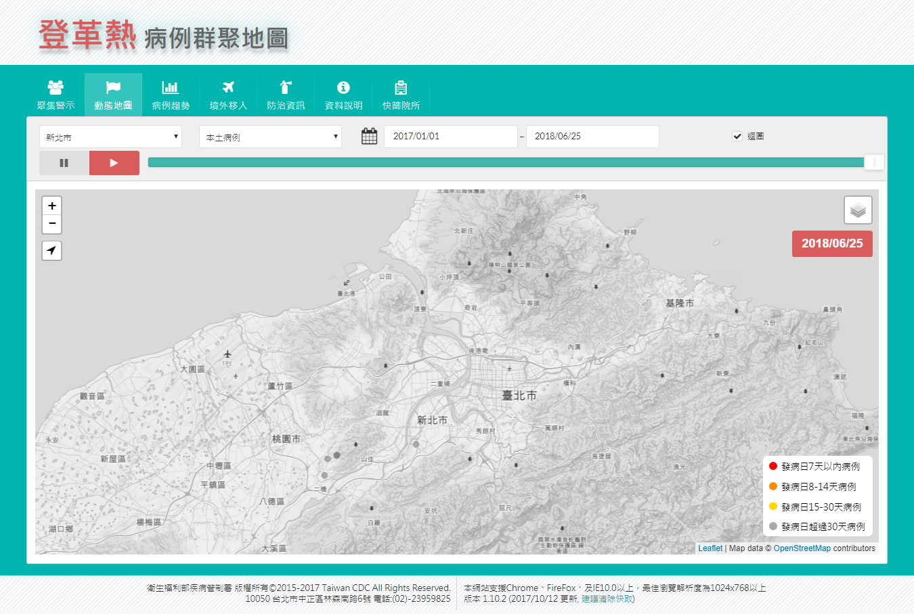
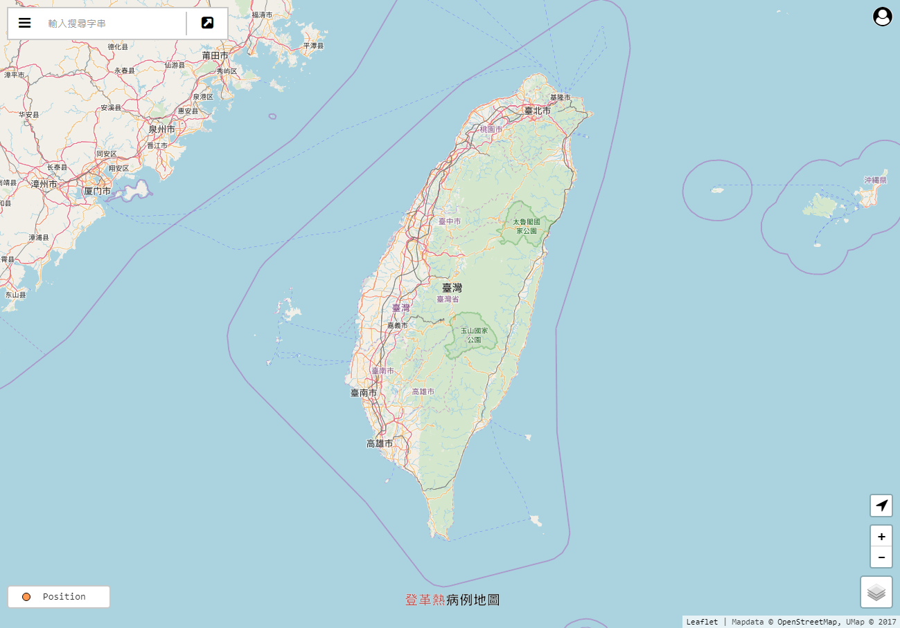

# CDC Dengue Map

[](https://travis-ci.org/jiankaiwang/umap)


CDC Dengue Map is the revision of CDC Dengue Clustering Map (https://cdcdengue.azurewebsites.net/).

* the first version view of CDC Dengue Clustering Map




* the revision of CDC Dengue Map




## Preparation


#### Redis or Express-session

*   Edit the app.js.

```javascript
// the following setting is using origin express-session
app.use(express.cookieParser());
app.use(session({
  secret: wo.getSessionHash(), 
  cookie: {maxAge: 30 * 60 * 1000},	// existing time period : ms
  resave: false,
  saveUninitialized: true
}));
```


## Deployment


There are two main deployment methods for the revision, running as standalone app and in the container.


### Standalone 

* Requirement:
  * nodejs: 8.x or more

* Quickstart commands

```shell
# Clone the Reposiroty
cd ~
git clone https://github.com/jiankaiwang/cdcdenguemap.git
cd ./cdcdenguemap

# start the app
npm install --save -G
sudo npm start
```


### Container (Docker)

* Requirement:
  * docker-ce: 16.x or more
* Quickstart commands


