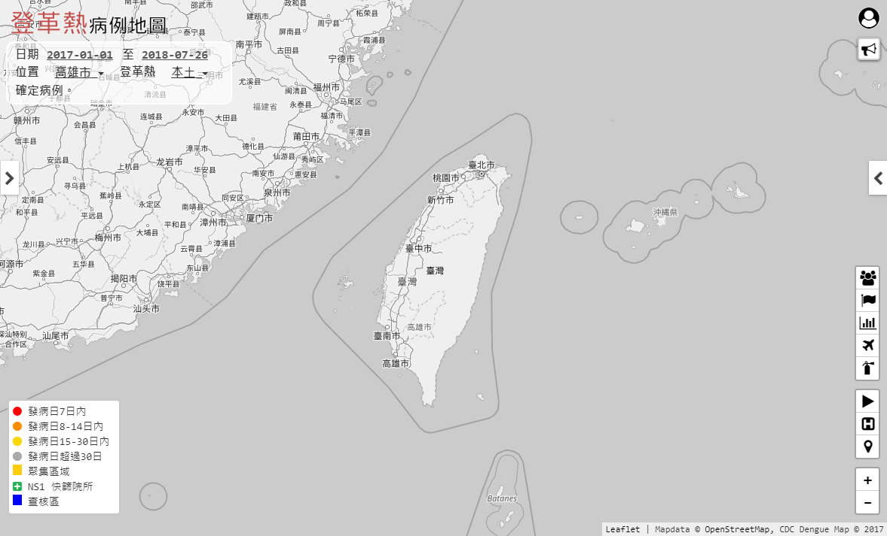

# CDC Dengue Map

[](https://travis-ci.org/jiankaiwang/cdcdenguemap)


CDC Dengue Map is the revision of CDC Dengue Clustering Map (https://cdcdengue.azurewebsites.net/).

* the first version view of CDC Dengue Clustering Map


* the revision of CDC Dengue Map




## Preparation


### Install Redis

* Install the service.

```shell
cd ~
wget http://download.redis.io/redis-stable.tar.gz
tar xvzf redis-stable.tar.gz
sudo mv redis-stable /opt/
cd /opt/redis-stable
make

# install at least tcl 8.5 version
sudo apt-get install tcl8.5-dev

# check whether the build works
make test

# add to the bin path
sudo cp src/redis-server /usr/local/bin/
sudo cp src/redis-cli /usr/local/bin/
```


* Configure the redis (`/path/to/your/redis/redis.conf`).

```ini
# default bind ip or 0.0.0.0 for all interfaces
bind 127.0.0.1

# default service port
port 6379

# modify foobared with "examplePWD"
requirepass examplePWD

# modify to no to avoid MISCONF issue
stop-writes-on-bgsave-error no
```


*   Build the service.

```shell
sudo vim /etc/systemd/system/redis.service
```

Create a user to run the service.

```shell
sudo adduser --system --group --no-create-home redis
sudo mkdir /var/lib/redis
sudo chown redis:redis /var/lib/redis
sudo chmod 770 /var/lib/redis
```

And add the following configure.

```ini
[Unit]
Description=Redis In-Memory Data Store
After=network.target

[Service]
User=redis
Group=redis
ExecStart=/usr/local/bin/redis-server /opt/redis-stable/redis.conf
ExecStop=/usr/local/bin/redis-cli shutdown
Restart=always

[Install]
WantedBy=multi-user.target
```

Start and enable the service.

```shell
sudo systemctl status redis.service
sudo systemctl start redis.service
sudo systemctl enable redis.service
```


* Test the redis service.

```shell
# PONG
redis-cli -h localhost -p 6379 -a examplePWD ping
```


## Deployment


There are two main deployment methods for the revision, running as standalone app and in the container.


### Standalone 

* Requirement:
  * nodejs: 8.x or more

* Quickstart commands

```shell
# Clone the Reposiroty
cd ~
git clone https://github.com/jiankaiwang/cdcdenguemap.git
cd ./cdcdenguemap

# start the app
npm install --save -G
sudo npm start
```


### Container (Docker)

* Requirement:
  * docker-ce: 16.x or more
* Quickstart commands


## Advanced

More settings are refered to the document [Document.md](Document.md).

